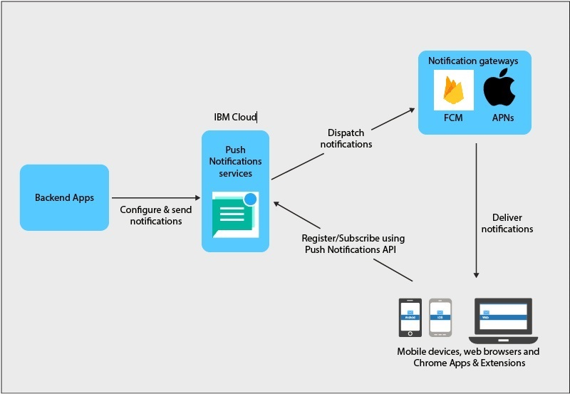

----

copyright:
 years: 2015, 2017

---

{:new_window: target="_blank"}
{:shortdesc: .shortdesc}
{:screen:.screen}
{:codeblock:.codeblock}
{:pre: .pre}
{:tip: .tip}

# About Push Notifications 
{: #overview-push}
Last updated: 09 June 2017
{: .last-updated}

IBM {{site.data.keyword.mobilepushshort}} is a service with which you can use to send notifications to mobile devices and browsers. Notifications can be targeted to all application users or to a specific set of users and devices using tags. For every message that you submit to the service, the intended audience receives a notification.

You can choose to use the {{site.data.keyword.mobilepushshort}} service either as a part of MobileFirst Services Starter Boilerplate or as Bluemix [Dedicated Services](/docs/dedicated/index.html).  You can also use an SDK (software development kit) and [REST APIs ](https://mobile.ng.bluemix.net/imfpush/){: new_window} to further develop your client applications.

The {{site.data.keyword.mobilepushshort}} service is also enabled for [OpenWhisk](/docs/openwhisk/index.html). OpenWhisk is a distributed, event-driven compute service that is alternatively known as serverless computing. This allows developers to focus on writing application logic, and create actions that are executed on demand.

## Service processes
{: #overview_push_process}

Mobile, Web browser clients and Google Chrome Apps & Extensions can subscribe and register for the {{site.data.keyword.mobilepushshort}} service. On start-up, the client applications will register and subscribe themselves to the {{site.data.keyword.mobilepushshort}} service. The notifications are dispatched to the Apple Push Notification Service (APNs) or Firebase Cloud Messaging (FCM)server and then sent to registered mobile device, browser clients or Chrome Apps & Extensions.

### Mobile, browser applications and Chrome Apps & Extensions
{: #mobile-applications}

On start-up, client applications register and subscribe themselves to the {{site.data.keyword.mobilepushshort}} service to receive notifications.

### Back end applications
{: #backend-applications}

Back end applications can be either on premise, or in a public cloud. Back end applications will use the {{site.data.keyword.mobilepushshort}} service to send context-sensitive notifications to mobile, browser application and Chrome Apps & Extensions users. The back end applications are not required to maintain and manage mobile devices, browser agents and user information for sending push notifications. Instead, back end applications can use the {{site.data.keyword.mobilepushshort}} service which will manage and maintain them.

### App backend owner
{: #app-backend-owner}

The App back-end owner creates the mobile back end application which bundles an instance of the {{site.data.keyword.mobilepushshort}} service. The App back end owner also configures and sets up the {{site.data.keyword.mobilepushshort}} service to suit the back end applications using the service along with mobile  and browser applications that are target for {{site.data.keyword.mobilepushshort}}.

### Push Notification service
{: #push-notification-service}

The {{site.data.keyword.mobilepushshort}} service manages all information related to mobile devices and web browser clients that are registered for notifications. The service keeps your applications transparent to the technology details of sending notifications to heterogeneous mobile and web browser platforms, handling all of this within.

### Gateways
{: #gateways}

Platform specific Push Notifications cloud services such as FCM/GCM or Apple Push Notification Service (APNs) that is used by IBM {{site.data.keyword.mobilepushshort}} service to dispatch notifications to the mobile and browser applications.

### Security
{: #push-security}

{{site.data.keyword.mobilepushshort}} APIs are secured by two types of secrets:

- **appSecret**: The `appSecret` protects APIs that are typically invoked by back end applications - such as the API to send {{site.data.keyword.mobilepushshort}} and the API to configure settings.
- **clientSecret**:  The `clientSecret` protects APIs that are typically invoked by mobile client applications. There is only one API related to registration of a device with an associated UserId that requires this `clientSecret`. None of the other APIs invoked from mobile clients require the `clientSecret`. 

The `appSecret` and `clientSecret` are allocated to every service instance at the time of binding an application with {{site.data.keyword.mobilepushshort}} service. Refer to the [REST APIs ](https://mobile.{DomainName}/imfpush/) documentation for information on how the secrets are to be passed and for what APIs.

**Note**: Earlier applications were required to pass the clientSecret only when registering or updating devices with userId field. All other APIs invoked by mobile and browser clients did not require clientSecret. These old applications can continue to use the clientSecret optionally for device registrations or updating calls. However, it is strongly recommended that clientSecret check is enforced for all client API calls. To enforce this in existing applications, there is a new `verifyClientSecret` API that is published.  For new applications, clientSecret check will be enforced on all client API calls and this behavior cannot be changed with the `verfiyClientSecret` API.

By default, client secret verification is enforced only in new apps. Both existing and new apps are allowed to enable or disable the client secret verification using the verifyClientSecret REST API. It is recommended that you enforce client secret verification to avoid exposing devices to users who might know the applicationId and deviceId.

Ensure that the `clientSecret` is kept confidential and never hard-coded into the mobile app. There are various application initialization patterns that can be used to pull in the `clientSecret` dynamically during the applications runtime. The sequence diagram outlines on such possible pattern.
 

## Message size
{: #push-message-size}

The {{site.data.keyword.mobilepushshort}} message payload size is dependent on the constraints laid out by the Gateways (FCM/GCM, APNs) and client platforms. 

- For iOS and Safari: For iOS 8 and later, the maximum size allowed is 2 kilobytes. APNs does not send notifications that exceed this limit.
- For Android, Firefox browser, Chrome browser, and Chrome Apps & Extensions: There is a limitation of 4 kilobytes as the maximum allowed message payload size.

## Samples
{: #push-blog}

Sample applications are available for [Android](https://github.com/ibm-bluemix-mobile-services/bms-samples-android-hellopush/), [Cordova](https://github.com/ibm-bluemix-mobile-services/bms-samples-cordova-hellopush), and [iOS](https://github.com/ibm-bluemix-mobile-services/bms-samples-swift-hellopush).
You can also find more information at the Push Notifications service [Blog](http://push-notification-service.mybluemix.net/) page.  

## Scenario used in this service
{: #push-scenario}

The {{site.data.keyword.mobilepushshort}} service is explained using the sample scenario of the ACME Bank. The ACME Bank is in the phase of having their legacy IT infrastructure moved to IBM Bluemix services and is currently building mobile back-end for their customer and employee facing apps. They are using {{site.data.keyword.mobilepushshort}} service to send notification to their customers on banking transactions and other important events and reminders.

