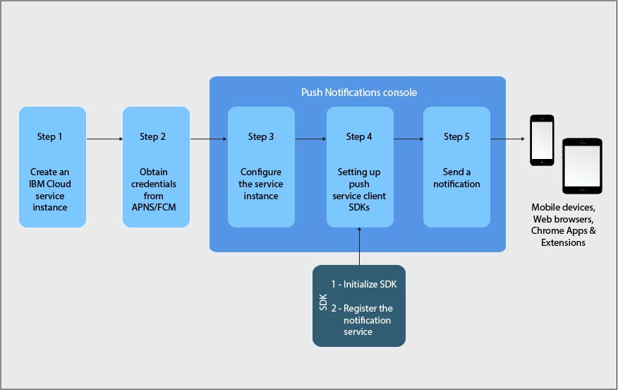

---

copyright:
  years: 2015, 2017, 2018, 2019
lastupdated: "2019-05-30"

keywords: push notifications, ibm cloud catalog, push service client sdk, notification provider

subcollection: mobile-pushnotification

---

{:new_window: target="_blank"}
{:shortdesc: .shortdesc}
{:screen:.screen}
{:codeblock:.codeblock}
{:pre: .pre}
{:tip: .tip}

# Getting started tutorial
{: #getting-started}

{{site.data.keyword.mobilepushshort}} is available as an IBM Cloud Catalog service in the Mobile category and enables you to send and manage mobile and web push notifications. A push notification is an alert indicating a change or update on a mobile device or browser.
{:shortdesc}

Push Notifications are an universally accepted communication channel across enterprises or for a wide spectrum of audience. You can deliver these notifications as an onscreen banner alert or to a device's locked screen, thus providing information updates that are quickly and easily accessible.  

The basic steps that will get you started:

1. [Create an IBM Cloud service instance](https://cloud.ibm.com/docs/services/mobilepush?topic=mobile-pushnotification-push_step_1a)
2. [Obtain your notification provider credentials](https://cloud.ibm.com/docs/services/mobilepush?topic=mobile-pushnotification-push_step_1)
3. [Configure the service instance](https://cloud.ibm.com/docs/services/mobilepush?topic=mobile-pushnotification-push_step_2)
4. [Setup Push service client SDK's](https://cloud.ibm.com/docs/services/mobilepush?topic=mobile-pushnotification-push_step_3)
5. [Send a notification](https://cloud.ibm.com/docs/services/mobilepush?topic=mobile-pushnotification-push_step_4)

The following image gives you an overview of the Push Notifications service life cycle.

