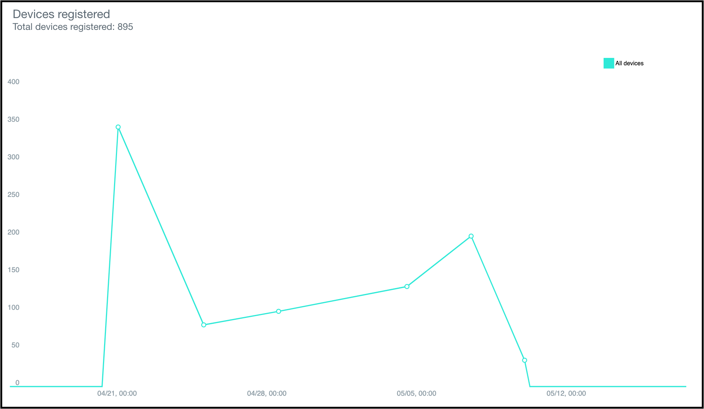

---

copyright:
  years: 2015, 2019
lastupdated: "2019-05-30"

keywords: push notifications, notifications, monitoring notification

subcollection: mobile-pushnotification

---

{:new_window: target="_blank"}
{:shortdesc: .shortdesc}
{:screen:.screen}
{:codeblock:.codeblock}

# Monitor notifications 
{: #push_monitoring}

The IBM {{site.data.keyword.mobilepushshort}} service now extends capabilities to monitor the push performance by generating graphs from your user data. You can use the utility to list all the sent push notifications, or to list all the registered devices and to analyze information on a daily, weekly, or monthly basis.

To generate reports for all your the sent notifications, use the Push Messages GET report method in [REST APIs](https://eu-gb.imfpush.cloud.ibm.com/imfpush/#!/messages/get_apps_applicationId_messages_report){: new_window}. 
	
 &nbsp; 
	

To generate reports for all your registered devices, use the Push Device Registrations GET report method in [REST APIs](https://eu-gb.imfpush.cloud.ibm.com/imfpush/#!/devices/get_apps_applicationId_devices_report){: new_window}.
	
 &nbsp; 
	

For information on how to enable monitoring utility for your platform:

 - [Monitoring push notifications on Android devices](https://github.com/ibm-bluemix-mobile-services/bms-clientsdk-android-push/tree/Doc#monitoring).
 - [Monitoring push notifications on iOS applications](https://github.com/ibm-bluemix-mobile-services/bms-clientsdk-swift-push/tree/Doc#enable-monitoring).

Note:

1. The {{site.data.keyword.mobilepushshort}} monitoring tab does not show analytics data.
2. The report that is generated using the REST APIs will be cached and the cache is maintained for thirty minutes.
Also, the data represented in the graph will be generated from the cached data.
 
