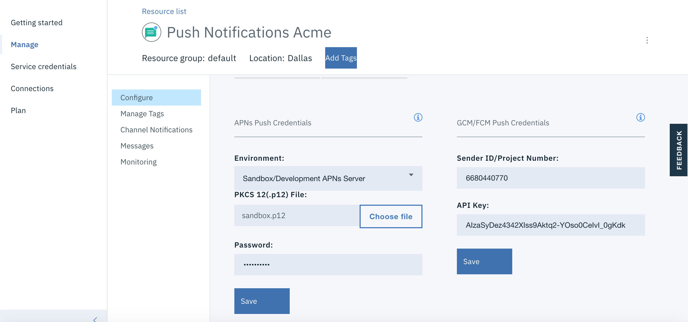
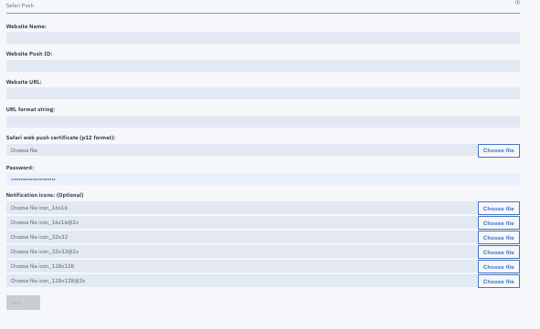

---

copyright:
  years: 2015, 2020
lastupdated: "2020-02-04"

keywords: push notifications, notifications, service instance, cordova application

subcollection: mobile-pushnotification

---

{:external: target="_blank" .external}
{:shortdesc: .shortdesc}
{:codeblock: .codeblock}
{:pre: .pre}
{:screen: .screen}
{:tsSymptoms: .tsSymptoms}
{:tsCauses: .tsCauses}
{:tsResolve: .tsResolve}
{:tip: .tip}
{:important: .important}
{:note: .note}
{:download: .download}
{:java: .ph data-hd-programlang='java'}
{:ruby: .ph data-hd-programlang='ruby'}
{:c#: .ph data-hd-programlang='c#'}
{:objectc: .ph data-hd-programlang='Objective C'}
{:python: .ph data-hd-programlang='python'}
{:javascript: .ph data-hd-programlang='javascript'}
{:php: .ph data-hd-programlang='PHP'}
{:swift: .ph data-hd-programlang='swift'}
{:reactnative: .ph data-hd-programlang='React Native'}
{:csharp: .ph data-hd-programlang='csharp'}
{:ios: .ph data-hd-programlang='iOS'}
{:android: .ph data-hd-programlang='Android'}
{:cordova: .ph data-hd-programlang='Cordova'}
{:xml: .ph data-hd-programlang='xml'}

# Step 3: Configure a service instance 
{: #push_step_2}

Ensure that you have gone through [Obtain your notification credentials](/docs/services/mobilepush?topic=mobile-pushnotification-push_step_1).

## For Android and Chrome Apps & Extensions
{: #push_step_2_Android}

Ensure that you have gone through [Obtain your notification provider credentials](/docs/services/mobilepush?topic=mobile-pushnotification-push_step_1) to set up the FCM project and obtain your credentials.

To configure FCM credentials for Android applications and Google Chrome Apps & Extensions, complete the following steps:

1. Open your IBM Cloud catalog and then click the {{site.data.keyword.mobilepushfull}} service instance that you have created. 
1. Click **Manage** > **Configure**. 
1. Choose either of the following options: 
   - For Android: Select **Mobile** and then update the FCM Push Credentials tab with the Sender ID/Project number and API Key. 
   - For Google Chrome Apps & Extensions: Select **Web** and then update the Chrome Apps and Extensions tab with the Sender ID/Project number and API Key. 
1. Click **Save**. The {{site.data.keyword.mobilepushfull}} service is now configured.

Your next step is to [set up the Push service client SDK's](/docs/services/mobilepush?topic=mobile-pushnotification-push_step_3).

## For Cordova applications 
{: #push_step_2_b}

Cordova is a platform for building hybrid applications with JavaScript, CSS, and HTML. The {{site.data.keyword.mobilepushshort}} service supports development of Cordova-based iOS and Android applications.

To enable Cordova applications for receiving push notifications to your devices, go through [{{site.data.keyword.mobilepushfull}} Cordova plug-in Push SDK](https://github.com/ibm-bluemix-mobile-services/bms-clientsdk-cordova-plugin-push/tree/Doc#ios-app){: external}.

## For iOS applications and Safari browser 
{: #enable-push-ios-notifications}

To use the {{site.data.keyword.mobilepushshort}} service to send notifications, upload the `.p12` certificates that you had created in Step 1:[Obtain your notification provider credentials](/docs/services/mobilepush?topic=mobile-pushnotification-push_step_1). This certificate contains the private key and SSL certificates that are required to build and publish your application. You can also use the REST API to upload an APNs certificate.

After the `.cer` file is in your key chain access, export it to your computer to create a `.p12` certificate.
{: note}

For more information about using the APNs, see [iOS Developer Library: Local and Push Notification Programming Guide](https://developer.apple.com/library/content/documentation/NetworkingInternet/Conceptual/RemoteNotificationsPG/APNSOverview.html#//apple_ref/doc/uid/TP40008194-CH8-SW1){: external}.

To set up APNs on the Push Notification services console, complete the steps:

1. Select **Configure** on the Push Notification services console.
1. Choose the **Mobile** option to update the information in the **APNs Push Credentials** form.
1. Choose either of the following options:
   - For **Mobile** option
      1. Select **Sandbox** (development) or **Production** (distribution) and then upload the `p.12` certificate that you have created. 

         

      1. In the **Password** field, enter the password that is associated with the `.p12` certificate file, then click **Save**.
   - For **Web** option
      - In the Safari Push section, update the form with the required information. 
         - **Website Name**: This is the name that you have provided in the Notification center.
         - **Website Push ID**: Update with the reverse-domain string for your Website Push ID. For example, web.com.acmebanks.www.
         - **Website URL**: Provide the URL of the website that should be subscribed to push notifications. For example, `https://www.acmebanks.com`.
         - **Allowed Domains**: This is optional parameter. This is the list of websites that requests permission from the user. Ensure that the URLs are comma-separated values. Note that the value in Website URL will be used if this is not provided. 
         - **URL Format String**: The URL to resolve when the notification is clicked. For example, [`https://www.acmebanks.com`]. Ensure that the URL use the http or https scheme.
         -**Safari web push certificate**: Upload the .p12 certificate and provide the password.
1. Click **Save**.	

   	

After you have set up the service for iOS applications, you need to [Set up Push service client SDKs](/docs/services/mobilepush?topic=mobile-pushnotification-push_step_3).

## For Chrome and Firefox browsers 
{: #push_step2_chromefirefox}

1. On the {{site.data.keyword.mobilepushshort}} console, select **Configure**.
1. Select the Web tab.
   
1. Configure the FCM API key and the URL of your website that will be registered to receive push notifications.
1. Click **Save**.
1. After you have set up the service, you need to [Set up Push service client SDKs](/docs/services/mobilepush?topic=mobile-pushnotification-push_step_3).
