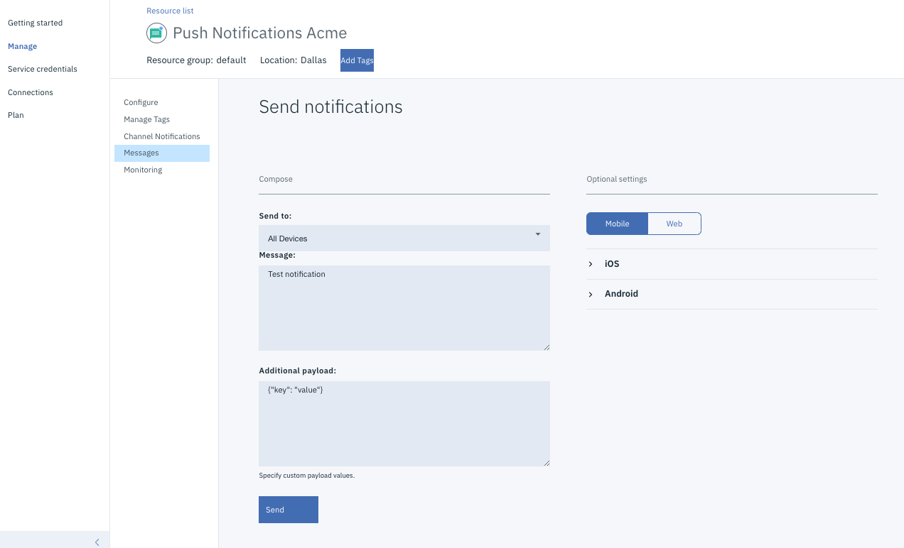
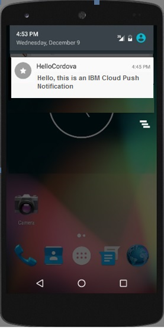
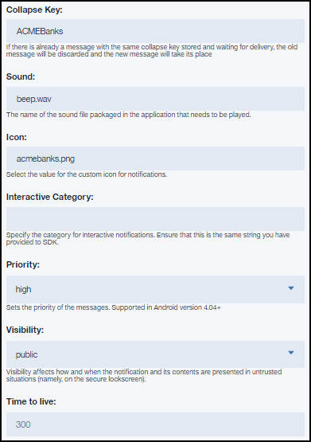

---

copyright:
 years: 2015, 2017

---

{:new_window: target="_blank"}
{:shortdesc: .shortdesc}
{:screen:.screen}
{:codeblock:.codeblock}

# Step 5: Sending a notification
{: #push_step_4}
Last updated: 27 June 2017
{: .last-updated}

After you have developed your applications, you can send basic push notifications.

To send basic push notifications, complete the following steps:

1. Select **Send Notifications**, and compose a message by choosing a **Send to** option. The supported options are **Device by Tag**, **Device Id**, **User Id**, **Android devices**, **iOS devices**, **Web Notifications**, and **All Devices**.
**Note**: When you select the **All Devices** option, all devices subscribed to {{site.data.keyword.mobilepushshort}} will receive notifications.
	
	

2. In the **Message** field, compose your message. Choose to configure the optional settings as required.
3. Click **Send**.
3. Verify that your devices or browser has received the notification.

The following screen shot shows an alert box handling a push notification in the foreground on a Android device.
	

The following following screen shot shows a push notification in the background for Android.
	

## Optional Android settings 
{: #push_step_4_Android}

You can further customize the {{site.data.keyword.mobilepushshort}} settings for sending notifications to Android devices. 

The following optional customization options are supported:

- Collapse Key:  Collapse keys are attached to notifications. If multiple notifications arrive sequentially with the same collapse key when the device is offline, they are collapsed. When a device comes online, it receives notifications from the FCM/GCM server, and displays only the latest notification bearing the same collapse key. If the collapse key is not set, both the new and old messages are stored for the future delivery.
- Sound: Indicates a sound clip to be played on the receipt of a notification. Supports default or the name of a sound resource that is	 bundled in the app.
- Icon: Specify the name of the icon to display for the notification. Ensure that you have packaged the icon in the `res/drawable` folder, with the client application.
- Priority: Specifies the options for assigning delivery priority to messages. 
	- A priority `high` or `max` will result in heads-up notification.
	- A priority `low` or `default` will not open network connections on a sleeping device. 
- Visibility: You can choose to set the notification visibility option to either `public` or `private`. 
	- The `private` option restricts public viewing and you can choose to enable it if your device is secure with a pin or pattern, and the notification setting is set to **Hide sensitive notification content**. When the visibility is set as `private`, a `redact` field must be mentioned. Only the content specified in the `redact` field will show up on a secure locked screen on the device. 
	- The `public` option would render the notifications to be freely read.
- Time to live: This value is set in seconds. If this parameter is not specified, the FCM/GCM server stores the message for four weeks and will try to deliver. The validity expires after four weeks. The possible value range is from 0 to 2,419,200 seconds.
- Delay when idle: You can set this to either of the following values:
	- `True` instructs the FCM/GCM server not to deliver the notification if the device is idle. 
	- `False` ensures notification delivery even if the device is idle.
- Sync: By setting this option to `true`, notifications across all your registered devices are in sync. If the user with a username has multiple devices with the same application installed, reading the notification on one device ensures deletion of notifications in the other devices. You need to ensure that you are registered with {{site.data.keyword.mobilepushshort}} service with userId for this option to work.
- Additional payload: Specifies the custom payload values for your notifications.
- Expandable notification: This provides customers an option to expand a notification with more information, while a basic notification would be visible with the notification collapsed. The following options are supported:
	- Big Picture Notifications: You can choose to include a picture when the notification is expanded. Ensure that you provide a Title text and URL for the picture.
	- Big Text Notifications: You can choose to include additional text with a title. Ensure that the Big Text message and Title text information is furnished.
	- Inbox Style Notifications: You can send the notification styled as an inbox notification. Provide a Title text and furnish the message in Lines.	 

## Optional iOS settings 
{: #push_step_4_ios}

You can customize the {{site.data.keyword.mobilepushshort}} settings for sending notifications to iOS devices. The following optional customization options are supported.

- **Badge**:  Indicates the number that is displayed on the application badge. The default value is zero (0), and this would not display a badge. 
- **Sound**: Indicates a sound clip to be played on the receipt of a notification. Supports default or the name of a sound resource bundled in the app.
- **Additional payload**: Specifies the custom payload values for your notifications.

You can also choose to enable [interactive notifications](https://github.com/ibm-bluemix-mobile-services/bms-clientsdk-swift-push/tree/Doc#interactive-notifications) and [rich media notifications](https://github.com/ibm-bluemix-mobile-services/bms-clientsdk-swift-push/tree/Doc#enabling-rich-media-notifications).

## Monitoring for delivered notifications 
{: #push_step_4_monitor}

The {{site.data.keyword.mobilepushshort}} service provides a monitoring utility to help you check the status of messages that are sent. To configure your monitoring utility, go through either of the following options:

- [Enable monitoring for Android applications](https://github.com/ibm-bluemix-mobile-services/bms-clientsdk-android-push/tree/Doc#monitoring).
- [Enable monitoring for iOS applications](https://github.com/ibm-bluemix-mobile-services/bms-clientsdk-swift-push/tree/Doc#enable-monitoring).
