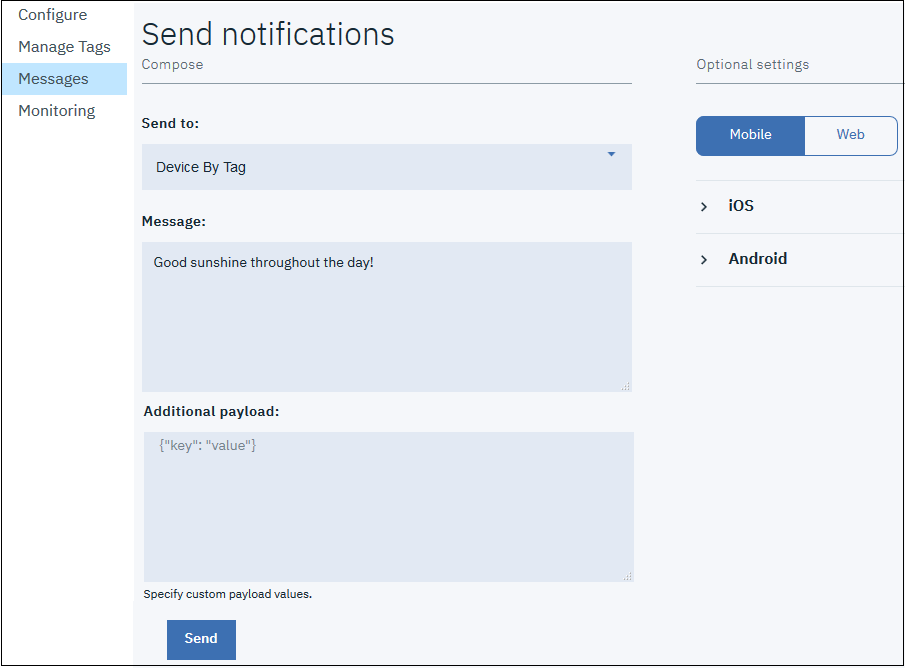

---

copyright:
  years: 2015, 2017, 2019
lastupdated: "18 February 2019"

---

{:new_window: target="_blank"}
{:shortdesc: .shortdesc}
{:screen:.screen}
{:codeblock:.codeblock}

# Tag-based notifications
{: #tag_based_notifications}

Tag-based notifications are messages targeted to all devices that are subscribed to a particular tag. Tags-based notifications allow segmentation of notifications based on subject areas or topics. Notification recipients can choose to receive notifications only if it is about a subject or topic that is of interest. Therefore, tags-based notification provides a means to segment recipients. This feature enables the ability to define tags and then send and receive messages by tags. A message is targeted to only the client application instances (on mobile, browser or as an app or extensions) that are subscribed to the tag. You must first create tags for the application, set up the tag subscriptions and then initiate the tag-based notifications. To send a tag-based notification that uses the REST API, ensure that the "tagNames" are provided when posting to the message resource.

You can define tags and then send and receive messages using tags. You must first create the tags for the application, create subscriptions and then initiate the tag-based notifications. To send a Tag-based notification using the [REST API](https://imfpush.ng.bluemix.net/imfpush/){: new_window}, ensure that the "tagNames" are provided when posting to the message resource.

## Managing tags
{: #manage_tags}

Use the {{site.data.keyword.mobilepushshort}} console to create and delete tags for your application and then initiate tag-based notifications. The tag-based notification is received on devices that are subscribed to tags.

### Creating tags
{: #create_tags}

Tag-based notifications are messages targeted to all devices subscribed to a particular tag. Each device can subscribe to any number of tags. 

1. On the {{site.data.keyword.mobilepushshort}} console, select the **Manage Tags** tab.
1. Click the + **Create Tag** button.   
   1. In the **Name** field, enter the name of the tag. For example, "coupons".
   1. In the **Description** field, enter a tag description.
   1. Click  **Save**.

1. In the **Code Snippets** area, select the platform for your mobile application.
1. Modify the code snippets to handle errors and then copy the code snippets for each tag into your mobile application.

### Deleting tags
{: #delete_tags}

1. From the **Tag** tab, select the tag that you want to delete and click **Delete** icon.
1. Click **OK**.

When a tag is deleted, information associated with the tag, including its subscribers and devices, are deleted. Automatic unsubscribe is not required, as the tag no longer exists. No further action is required from the client side.

### Editing a tag description
{: #edit_tags}

1. From the **Tag** tab, select the tag that you want to edit.
1. Click the **Edit** icon.
1. Edit the tag description and then click the **Save** button.

## Get tags
{: #get_tags}

Tags provide a way to send targeted notifications to users based on their interests, unlike general broadcasts that are sent to all applications. You can create and manage tags by using the Tags tab on the {{site.data.keyword.mobilepushshort}} console or use REST APIs. You can use code snippets to manage and query your tag subscriptions for your mobile application. You can use the code snippets to get subscriptions, subscribe to a tag, unsubscribe from a tag, or get a list of available tags. Copy these code snippets to your mobile application.

- For Android, see `getTags` API and `getSubscriptions` API in [Push Notification get tags on Android](https://github.com/ibm-bluemix-mobile-services/bms-clientsdk-cordova-plugin-push/tree/Doc#ios-app).

- For Cordova, see `retrieveAvailableTags()` API and `retrieveSubscriptions()` API in [Push Notifications get tags on Cordova](https://github.com/ibm-bluemix-mobile-services/bms-clientsdk-cordova-plugin-push/tree/Doc#push-notification-service-tags).

- For iOS, see `retrieveAvailableTagsWithCompletionHandler` API in the [Push Notifications get tags on Swift](https://github.com/ibm-bluemix-mobile-services/bms-clientsdk-swift-push/tree/Doc#retrieve-tags).

- For web browsers, see `retrieveAvailableTags()` API in [Push Notifications get tag on web browsers](https://github.com/ibm-bluemix-mobile-services/bms-clientsdk-javascript-webpush/blob/Doc/README.md#push-notification-service-tags).

## Subscribe tags
{: #Subscribe_tags}

Use the following API to allow your devices to retrieve tags, subscribe to a tag, retrieve subscriptions,  and unsubscribe from a tag.

- For Android, use the `getTags`, `subscribe`, `getSubscriptions`, and `unsubscribeFromTags` API's. See [Push Notifications subscribe tags for Android](https://github.com/ibm-bluemix-mobile-services/bms-clientsdk-android-push/tree/Doc#push-notification-service-tags).

- For Cordova, use the `retrieveAvailableTags()`, `subscribe()`, `retrieveSubscriptions()`, and `unsubscribe()` API's. See [Push Notifications subscribe tags for Cordova](https://github.com/ibm-bluemix-mobile-services/bms-clientsdk-cordova-plugin-push/tree/Doc#push-notification-service-tags).

- For iOS, use the `retrieveAvailableTagsWithCompletionHandler`, `subscribeToTags`, `retrieveSubscriptionsWithCompletionHandler`, and `unsubscribeFromTags` API's. See [Push Notifications subscribe tags for Swift](https://github.com/ibm-bluemix-mobile-services/bms-clientsdk-swift-push/tree/Doc#push-notification-service-tags).

- For web browsers, use the `retrieveAvailableTags()`, `subscribe()`, `retrieveSubscriptions()`, and `unSubscribe()` API's. See [Push Notifications subscribe tags for web browsers](https://github.com/ibm-bluemix-mobile-services/bms-clientsdk-javascript-webpush/blob/Doc/README.md#push-notification-service-tags).

## Using tag-based notifications
{: #using_tags}

Tag-based notifications are messages targeted to all devices that are subscribed to a particular tag. Each device can be subscribed to any number of tags. This topic describes how to send tag-based notifications. Subscriptions are maintained by the {{site.data.keyword.mobilepushshort}} service IBM Cloud instance. When a tag is deleted, all information associated with that tag, including its subscribers and devices are deleted. No automatic unsubscribe is needed for this tag since it no longer exists and no further action is required from the client side.

Create tags on the **Tag** screen. For information about how to create tags, see [Creating tags](#create_tags).

1. From the **Push Notification** console, click **Messages**.
2. Select the **Device by Tag** option in the **Send To** drop-down list.
3. Search for the tags that want to use and select them.

4. In the **Message Text** field, enter text that would be sent as a notification to the subscribed audience.
5. Click **Send**.

