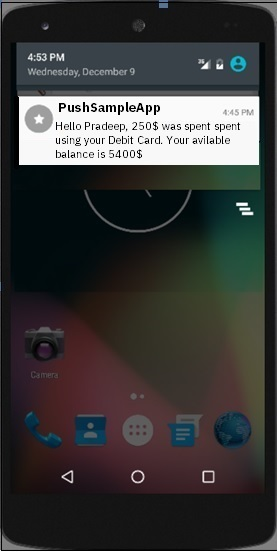

---

copyright:
  years: 2015, 2019
lastupdated: "2019-11-15"

keywords: push notifications, notifications, parameterize notification

subcollection: mobile-pushnotification

---

{:external: target="_blank" .external}
{:shortdesc: .shortdesc}
{:codeblock: .codeblock}
{:pre: .pre}
{:screen: .screen}
{:tsSymptoms: .tsSymptoms}
{:tsCauses: .tsCauses}
{:tsResolve: .tsResolve}
{:tip: .tip}
{:important: .important}
{:note: .note}
{:download: .download}
{:java: .ph data-hd-programlang='java'}
{:ruby: .ph data-hd-programlang='ruby'}
{:c#: .ph data-hd-programlang='c#'}
{:objectc: .ph data-hd-programlang='Objective C'}
{:python: .ph data-hd-programlang='python'}
{:javascript: .ph data-hd-programlang='javascript'}
{:php: .ph data-hd-programlang='PHP'}
{:swift: .ph data-hd-programlang='swift'}
{:reactnative: .ph data-hd-programlang='React Native'}
{:csharp: .ph data-hd-programlang='csharp'}
{:ios: .ph data-hd-programlang='iOS'}
{:android: .ph data-hd-programlang='Android'}
{:cordova: .ph data-hd-programlang='Cordova'}
{:xml: .ph data-hd-programlang='xml'}

# Parameterize Notifications
{: #template_based_notifications}

You can parameterize and send custom notifications by creating variables and calling them in your notification templates.

Your notification template can -
- Combine static and dynamic elements in your notifications
- Personalize notifications for each recipient by adding variables
- Can include multiple variables in your notification 

Pass variables as JSON objects in your application code during initialization.
   
```
MFPPushNotificationOptions options = new MFPPushNotificationOptions();

JSONObject tempValue = new JSONObject();
    try {

      tempValue.put("username",userName);

      tempValue.put("amountSpent",amount);

      tempValue.put("currency",currency);

      tempValue.put("avilableBalance",balance);

      } catch (JSONException e) {
            e.printStackTrace();
         }
      options.setPushVariables(tempValue); 

      push = MFPPush.getInstance();

      push.initialize(getApplicationContext(),appGuid,clientSecret,options);
```
{: codeblock}

Once the variables are defined, they can be called in your message template.

1. On the {{site.data.keyword.mobilepushshort}} console, select the **Messages** tab.
1. Compose a message by choosing a **Send to** option.
1. In the **Message** field, compose your message. Call the defined variables in the message template. Click **Send**.

   

Your custom notfication message will be sent by fetching the variable data -



The feature is enabled only for users who have opted the `Advanced Plan`. Select **Plan** in the {{site.data.keyword.mobilepushshort}} service console to [upgrade](https://cloud.ibm.com/docs/account?topic=account-changing#changing).
{: note}

## Limitations
{: #limitations}

- Currently, this feature is not supported on Safari
- Variables in the notification template may not work if an app is force quit on iOS. The limitation is not in control of SDK but comes from iOS.
